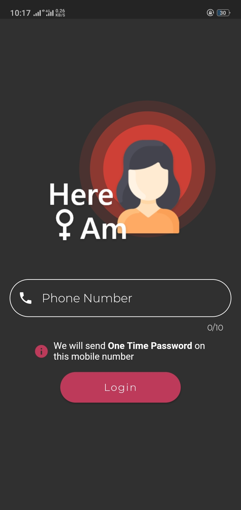
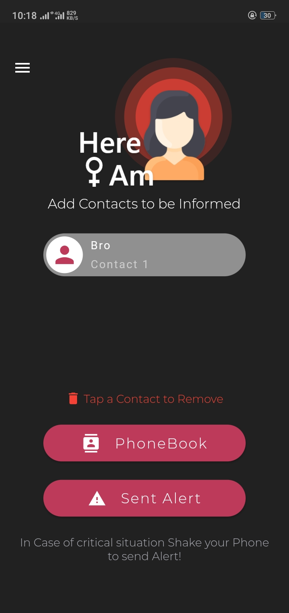
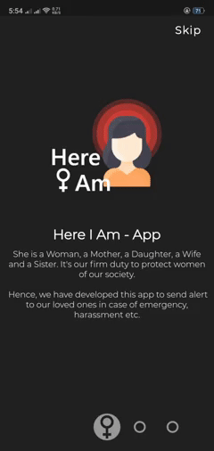
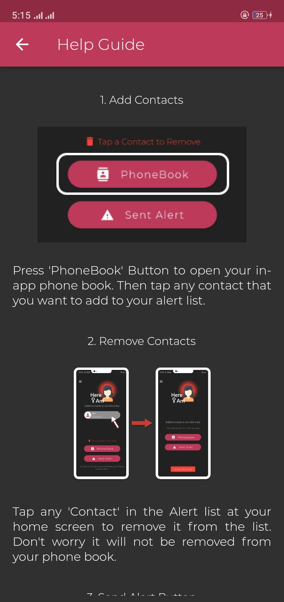
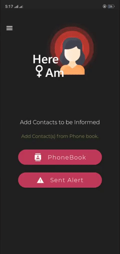

# Here I Am - Alert App

Here I am is an Alert app that Sends alert SMS holding your location (Address and Google Maps) to your loved ones.

P.S: It's my friend's Project and he allowed me to open source it :)

# Screen Shots

     

## Special Drawer

## What it does?

Here I Am - Is generally for all genders, but here it is specific to women protection. So, it sends your location which includes your address along with google maps link to that pin point location in SMS to the contacts that you have added in your alert list.
